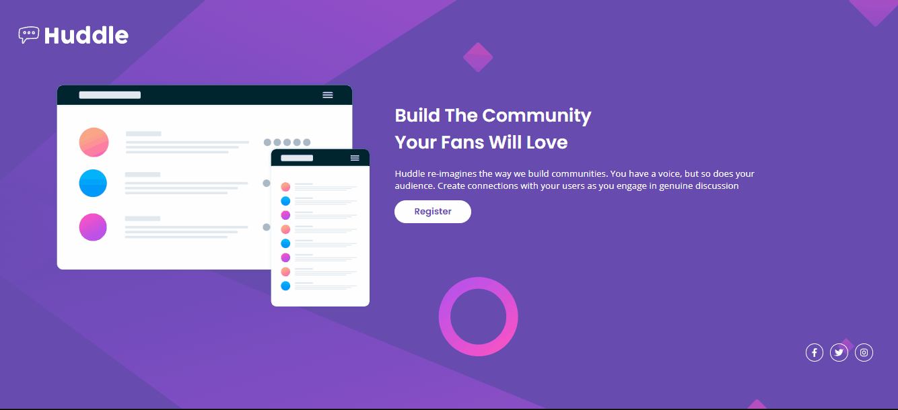

# Huddle

## Intuito do Projeto
Projeto proposto da primeira Quest do Curso DevQuest para reforçar o conhecimento do CSS com foco em Flexbox.

O projeto consiste em uma Landing Page chamada Huddle. A página possui um header com a Logo "Hoddle", o conteúdo principal com uma imagem e texto de apresentação com um botão abaixo escrito "Register", além de um footer com links para as redes sociais, sendo totalmente responsivo.

## desktop

## mobile

## Linguagens Utilizadas
* HTML.
* CSS.

### CSS
O CSS foi baseado em FlexBox.

## Considerações
Este projeto me proporcionou uma ótima oportunidade para colocar em prática os conhecimentos adquiridos durante o curso DevQuest. Espero que este pequeno projeto possa inspirar e ajudar outros estudantes de desenvolvimento web a iniciarem suas jornadas nesta área incrível.

## Créditos
***Agradeço a Curso DevQuest por fornecer o conhecimento necessário para a realização desse projeto.***